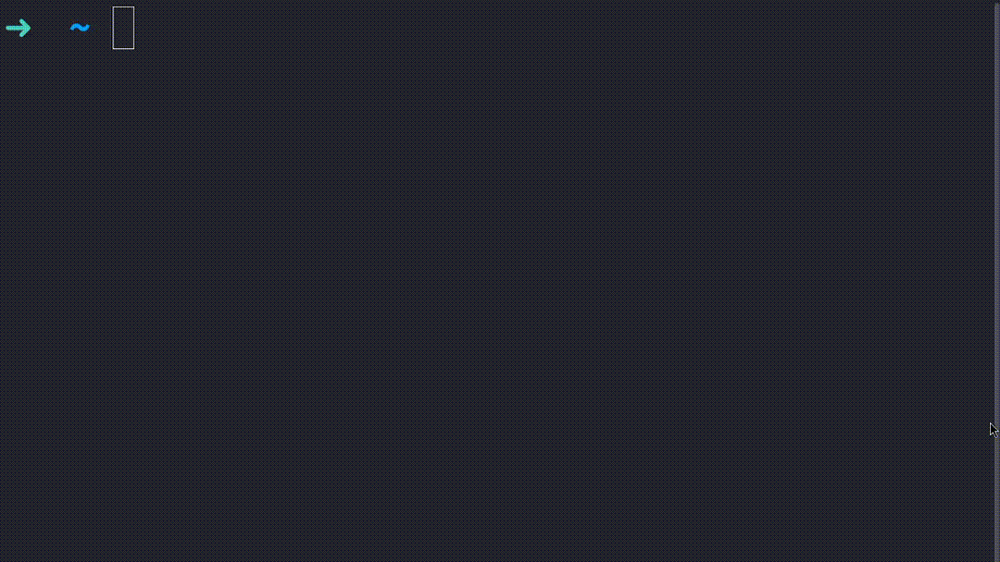

# The UNIX Shell (And others)

## An Introduction

First let's define what a "shell" is.

If you were to say google something like "define shell", you wouldn't get any
useful results. This is because in computing, the term shell has an entirely
different meaning, so here's my definition within the realm of computing.

> A shell is a method of talking to a computer, similar to your desktop, or
> your login screen that you see when you log in or start up your computer.

This definition still leaves much to be desired, but it does provide a very
broad definition of what a shell actually does. So allow me to further refine
this definition.

> A shell session consists of a series of commands inputted by the user. Each
> of these commands is evaluated as soon as they are entered. The result of
> each command is displayed before the next command can be entered.

Now we have a little bit more context, we can take a look at what a command
consists of. Consider the following example command

```sh
ls ~/Downloads
```

This command will list the contents of the user's `Downloads` folder below the
command, below which will be space for another command. This might not make
sense, so here's a picture to help you out.



As you can see, the earlier command was typed, the contents of the "Downloads"
folder were displayed and a new line was placed ready for the next command.

